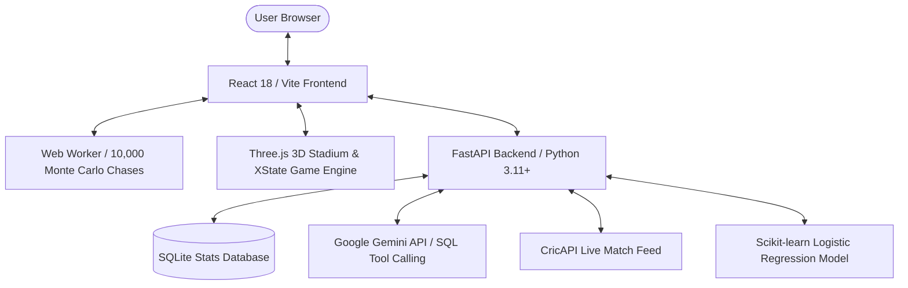

# Ballsense
> **The AI-Powered Cricket Workspace, Simulation Engine & 3D Interactive Stadium**

[](https://reactjs.org/)
[](https://fastapi.tiangolo.com/)
[](https://threejs.org/)
[](#machine-learning--analytics)
[](https://ai.google.dev/)

**Ballsense** is an all-in-one cricket analytics, predictive intelligence, and gaming platform. Built on career leaderboards, historical bilateral series results, and **4.4M+ ball-by-ball international deliveries**, Ballsense merges real-time live match tracking with AI-driven statistical analysis, empirical Monte Carlo chase simulations, and a fully interactive 3D stadium game.

---

## What Makes Ballsense Unique?

Ballsense goes beyond static stat tables by combining data science, generative AI, and real-time 3D web graphics into a single responsive application:

### 1. Fact-Grounded AI Analyst (Zero Hallucinations)
* **Executable SQL Synthesis**: Unlike traditional LLM chatbots that generate unverified stats, the **Cricket Assistant** uses Google Gemini function-calling to translate natural language questions into safe, read-only SQL queries executed live against a local SQLite database.
* **Grounded Answers**: Responses are generated strictly from actual database results, accompanied by structured data tables and analytical takeaways.

### 2. What-If Scenario Lab (10,000 Matched Monte Carlo Simulations)
* **Empirical Chase Model**: Simulates limited-overs chases ball-by-ball using an empirical joint probability model trained on **3,240+ international second-innings matches**.
* **Dynamic Condition Matrix**: Accounts for match format (T20 vs. ODI), innings phase (*Powerplay*, *Middle*, *Death*), wickets lost ($0-2, 3-5, 6-9$), and extras (*wides* and *no-balls*).
* **Parallel Worker Engine**: Runs 10,000 matched simulations per scenario in a Web Worker using synchronized seeds, providing $95\%$ Wilson confidence intervals without freezing the UI.
* **Live Match Cloning**: Seamlessly imports live second-innings match situations into the lab to simulate custom "what-if" strategic changes.

### 3. Nightfall 3D Stadium & Adaptive Hand Cricket Engine
* **Interactive 3D Arena**: A procedural floodlit stadium built with Three.js featuring instanced crowd animation, dynamic floodlight shadows, realistic player rigs, overarm bowling actions, and directional shot gaps.
* **Physics & Presentation Realism**: Features reactive fielders with 4.5 unit/sec chase speeds, two-handed keeper gathers, dislodged bails, precommitted $30\%$ overthrow variations, safe direct hits, boundary cheer squads, fireworks, and Man of the Match trophy presentations.
* **Adaptive AI Opponent**: Trained on **286,000+ T20 deliveries** to learn opponent hand patterns, adapt to required run rates, and optimize boundary prevention.

### 4. Leakage-Free Series Predictor
* **Time-Ordered Logistic Regression**: Predicts bilateral series win probabilities for ODI, Test, and T20I matchups.
* **No Future Data Leakage**: Features are constructed strictly from time-ordered historical records (rolling win rates, home/away splits, head-to-head records) with symmetric neutral-venue handling.

### 5. Local-First Matchup Notebook
* **In-Browser Comparison Storage**: Saves head-to-head player comparison snapshots locally using `localStorage`. Re-opening a saved snapshot restores instant stats and cached AI insights without burning extra API quota.

---

## Key Features

| Tab | Feature | Highlights |
|---|---|---|
| **Home / Overview** | **Match Centre** | Full-screen landing banner, quick feature launchpad, feed status, and instant navigation. |
| **Cricket Assistant** | **AI SQL Chat** | Natural language queries $\rightarrow$ validated SQL execution against 4.4M+ ball dataset. |
| **Series Predictor** | **ML Matchup Predictor** | Win probability predictions with custom team kit color mapping and historical stats breakdown. |
| **Live Matches** | **Real-Time Tracker** | CricAPI live feed with scores, venue, toss info, 5-min caching, rate-limit protection, and What-If cloning. |
| **Analytics** | **Global & Team Analytics** | Filterable career leaderboards across formats, team yearly trends, economy leaders, and series win rates. |
| **Player Comparison** | **Head-to-Head Comparison** | Side-by-side batting/bowling career metrics with visual Recharts cards and in-browser Notebook storage. |
| **What If Lab** | **Monte Carlo Chase Lab** | 10,000 matched simulations, interactive scenario controls, user prediction challenges, and score progression charts. |
| **Hand Cricket** | **3D Nightfall Arena** | XState rules engine, 3D stadium graphics, adaptive opponent, camera modes, cheer squads, and ceremony cutscenes. |

---

## Tech Stack & Architecture



### Frontend
* **Framework**: React 18.3, Vite 5
* **Graphics & 3D**: Three.js (Procedural geometries, instanced meshes, custom shaders/lighting)
* **State Management**: XState v5 (Game state machine) & React Hooks
* **Charts & Styling**: Recharts 3.0, Lucide React Icons, Custom Responsive CSS (Charcoal & Emerald palette)
* **Utilities**: Seedrandom (Deterministic simulation reproducibility)

### Backend
* **API Framework**: FastAPI, Uvicorn
* **Data Processing**: Pandas, PyArrow (Parquet streaming caches), SQLite3, NumPy
* **Machine Learning**: Scikit-Learn (Logistic Regression classifier), Joblib
* **External APIs**: Google GenAI SDK (Gemini Interaction API), CricAPI REST Client

---

## Project Structure

```
Cricket/
├── app.py                      # Streamlit alternative interface
├── requirements.txt            # Python dependencies
├── backend/
│   ├── main.py                 # FastAPI application entry & core routes
│   └── routes/                 # Specialized API routers (dashboard, player_comparison)
├── dataset/                    # Ball-by-ball CSV data & static leaderboards
│   └── ball_by_ball_data.csv   # 4.4M+ ball-by-ball dataset (2003-2024)
├── data/                       # Serialized models & Parquet caches
│   └── series_model.joblib     # Trained Series Predictor model
├── src/                        # Python business logic & ML scripts
│   ├── ballbyball_stats.py     # Streaming CSV aggregator & Parquet cache builder
│   ├── chat_assistant.py       # Gemini SQL tool-calling engine
│   ├── cricapi_client.py       # Live score API client with TTL caching & retry logic
│   ├── db.py                   # SQLite database connection & schema helpers
│   ├── player_stats.py         # Player search, profile canonicalization & stats merging
│   ├── series_predictor.py     # Series Predictor feature engineering & training
│   ├── train_chase_model.py    # Empirical What-If Chase Model trainer
│   └── train_hand_opponent.py  # Adaptive Hand Cricket AI trainer
├── frontend/                   # React SPA
│   ├── package.json            # Node dependencies
│   ├── vite.config.js          # Vite build configuration with polling
│   └── src/
│       ├── App.jsx             # Root layout & tab router
│       ├── api.js              # Backend API client
│       ├── components/         # React UI components & 3D Arena wrappers
│       │   ├── HandCricketTab.jsx # 3D Stadium & Game Controls
│       │   ├── WhatIfTab.jsx   # Monte Carlo Chase Simulator UI & Guide
│       │   ├── Wordmark.jsx    # Shared Ballsense branding component
│       │   └── ...
│       └── lib/                # Core frontend business logic & Web Workers
│           ├── chaseModel.json # Trained empirical delivery distribution artifact
│           ├── cricketGames.js # XState machine & chase simulation engine
│           └── cricketWorker.js# Parallel Web Worker for 10,000 chase trials
└── tests/                      # Python backend unit tests
```

---

## Installation & Setup

### Prerequisites
* **Python**: 3.11 or higher
* **Node.js**: v18 or higher (v20+ recommended)
* **npm**: 9+

---

### 1. Backend Setup

> **Note for OneDrive Users**: If working inside a OneDrive-synced folder, create the virtual environment outside OneDrive (e.g. `C:\venvs\cricket-ai`) to avoid file-locking stalls during `pip install`.

```powershell
# Create virtual environment
python -m venv .venv

# Activate virtual environment
# Windows PowerShell:
.venv\Scripts\Activate.ps1
# macOS/Linux:
# source .venv/bin/activate

# Install Python dependencies
pip install -r requirements.txt

# Configure environment variables
copy .env.example .env
```

Edit `.env` and add your API keys:
```env
GEMINI_API_KEY=your_gemini_api_key_here
CRICAPI_KEY=your_cricapi_key_here
```

*(Optional: You can specify backup Gemini keys `GEMINI_API_KEY_2`, `GEMINI_API_KEY_3` for automatic failover).*

---

### 2. Frontend Setup

```powershell
cd frontend
npm install
```

---

## Running the Application

### Start the FastAPI Backend
From the repository root:
```powershell
uvicorn backend.main:app --host 127.0.0.1 --port 8000
```

### Start the React Dev Server
In a second terminal:
```powershell
cd frontend
npm run dev
```

Open **http://localhost:5173** in your browser. The Vite dev server automatically proxies `/api/*` requests to FastAPI on port 8000.

---

## Machine Learning & Model Training

Ballsense includes reproducible Python training scripts for offline model generation:

### 1. Rebuild the Empirical Chase Model
Trains the What-If Lab delivery distributions on 3,240+ international second-innings matches and measures held-out log loss:
```powershell
python -m src.train_chase_model
```
*Output*: Generates `frontend/src/lib/chaseModel.json`.

**Held-Out Delivery Fit Evaluation**:
On 50,000+ held-out legal deliveries from 2024 onward, negative log-likelihood (lower is better) improved over fixed baselines:
* **T20**: $1.5211 \rightarrow \mathbf{1.4835}$
* **ODI**: $1.2931 \rightarrow \mathbf{1.2255}$

---

### 2. Rebuild the Hand Cricket Adaptive AI
Fits phase-conditioned scoring tendencies and transition distributions from 286,000+ T20 deliveries:
```powershell
python src/train_hand_opponent.py
```
*Output*: Generates `frontend/src/lib/cricketTraining.js`.

---

### 3. Retrain the Series Predictor
Fits the time-ordered Logistic Regression classifier on bilateral series records:
```powershell
python -m src.series_predictor
```
*Output*: Serializes the pipeline to `data/series_model.joblib`.

---

## Testing & Verification

Ballsense includes 48+ Node unit tests covering deterministic simulation reproducibility, XState game state transitions, 20,000 seeded presentation cases, and storage fallback behavior, alongside Python unit tests for live data and ML logic.

```powershell
# Run frontend unit tests
npm --prefix frontend test

# Run Python backend unit tests
python -m unittest discover -s tests -p "test_*.py" -v

# Verify production build
npm --prefix frontend run build
```

---

## Contributing & License

Contributions, issues, and feature requests are welcome!
Feel free to open an issue or submit a pull request.

Distributed under the **MIT License**.

---

<p align="center">
  <b>Ballsense</b> • Beyond the boundary.
</p>
live filters, stale-score recovery, and snapshot import. Live UI success cases were checked
with explicitly labelled test fixtures because the configured account reported quota exhaustion.

## Visual Asset

The locally bundled stadium photograph (`frontend/public/cricket-ground.jpg`) is from
[Unsplash](https://images.unsplash.com/photo-1540747913346-19e32dc3e97e), used under the
[Unsplash license](https://unsplash.com/license). Country flags use FlagCDN with an initials
fallback. Game hand and pitch illustrations are local SVG; font requests use Google Fonts
with local system fallbacks.

## Run (Streamlit alternative)

```powershell
streamlit run app.py
```

The first run builds `data/cricket.db` (SQLite) and `data/series_model.joblib` automatically.
Delete either file to force a rebuild after changing the CSVs.

## Notes / limitations

- The leaderboard CSVs contain only *top all-time* career rows, not the full player pool.
- The series predictor only trains on rows it can confidently parse into two competing teams
  (bilateral series or two-team neutral-venue matches); multi-team tournaments (tri-series,
  World Cups, etc.) and draws/ties/no-results are excluded from training for label clarity.
- No API keys are stored in code - both are read from environment variables via `.env`
  (which is git-ignored). Get your own free keys from [aistudio.google.com/apikey](https://aistudio.google.com/apikey)
  (Gemini) and cricapi.com (CricAPI).
- If the Live Matches tab fails with a TLS/SSL certificate error, you're likely on a
  corporate network/VPN that intercepts TLS traffic. `pip-system-certs` (already in
  `requirements.txt`) fixes this for most Windows corporate networks by using the OS
  certificate store instead of the bundled certifi CAs - it does **not** disable
  verification. If it's still not enough, ask IT for the corporate root CA (a `.pem` file)
  and set `CRICAPI_CA_BUNDLE=<path-to-cert.pem>` in `.env` as a fallback.

